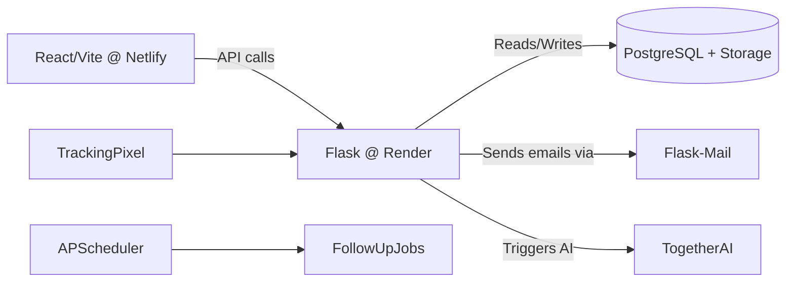

# 23Ventures Outreach App

A modern, secure outreach platform built for **23Ventures** (a venture capital & equity firm) to streamline personalized email campaigns, CSV uploads, and tracking of startup engagement.

---

## 🔗 Repository

[https://github.com/vedanschi/23ventures-outreach-app](https://github.com/vedanschi/23ventures-outreach-app)

## 🌐 Live Demo

- **Frontend (Netlify)**: https://23venturesoutreach.netlify.app  
- **Backend (Render)**: https://two3ventures-outreach-server.onrender.com

---

## 🛠️ Technology Stack

| Layer                  | Technology                                |
|------------------------|-------------------------------------------|
| Frontend               | React (Vite), Tailwind CSS                |
| Backend API            | Python, Flask, Flask-CORS, Flask-Mail     |
| Hosting                | Netlify (frontend), Render (backend)      |
| Database               | Supabase (PostgreSQL + Storage)           |
| Email AI               | Together AI                               |
| Scheduling             | APScheduler (Follow-up jobs)              |
| Authentication         | Supabase Auth (GitHub, Email)             |
| Environment Management | `.env` files, Netlify & Render env vars   |

---

## 🚀 Features

- **CSV Upload**  
  Encrypted CSV ingestion from Supabase Storage, batch import of startups.

- **Personalized Emails**  
  AI-driven content generation (initial outreach and follow-ups).

- **Email Sending**  
  Secure SMTP via Flask-Mail, DMARC/DKIM compliant.

- **Tracking Pixel**  
  One-pixel GIF to mark opens, stored against email records.

- **Role-based Access**  
  GitHub & email login, RLS policies in Supabase.

- **Dashboard**  
  View counts of startups added, emails sent, and response metrics.

---

## 🏗️ Architecture Overview

## License
MIT License - See LICENSE for details

This project is licensed under the [MIT License](LICENSE). All code, documentation, and data formats are available under MIT terms.

